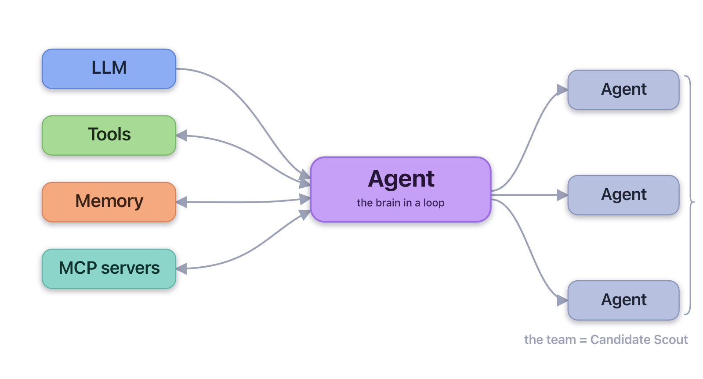
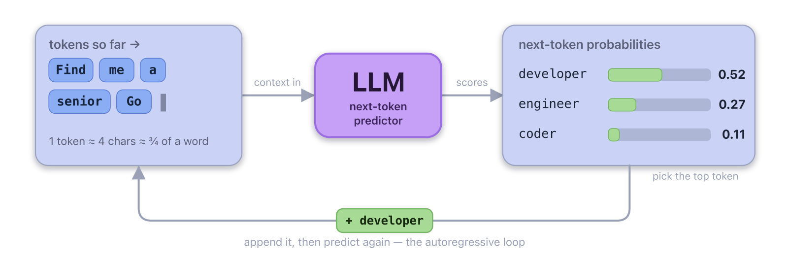
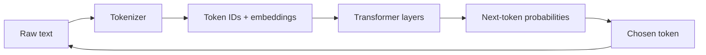
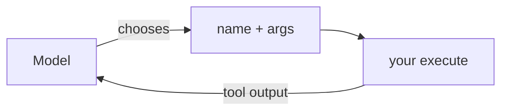
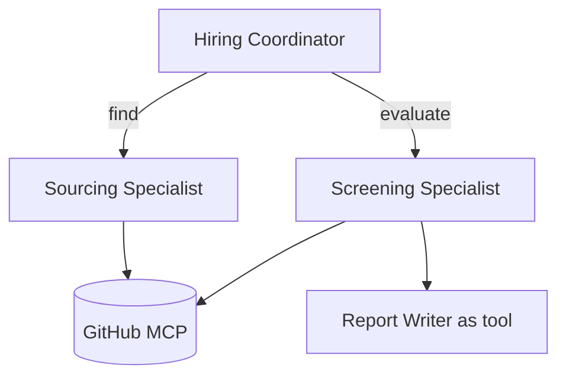

# What We Build Today

An agent that
scouts GitHub for engineering candidates using **OpenAI's Agents SDK for TypeScript**, with OpenRouter and _deepseek/deepseek-v4-flash_.



Each branch is a section. The team of agents = your Candidate Scout.
First branch - the brain: what is an LLM?

<!-- speaker_note: 'Welcome. Audience knows TS/Node but is NEW to LLMs. This ladder is the spine of the lecture - point back at it as each piece lands. Keep it brisk.' -->

<!-- end_slide -->

# What Is an LLM?



- An LLM is a **next-token predictor**: text in, one token out, repeat
- It is **stateless**: each API call starts from scratch
- It has **no memory** of previous calls and **cannot run code**

This is why we need **tools** (to act) and **sessions** (to remember).

> **Token** = a chunk of text the model reads and writes - roughly
> 4 characters, about ¾ of a word. It predicts these one at a time.

<!-- speaker_note: 'Demystify. It is autocomplete on steroids. Define token concretely - "candidate" is ~2-3 tokens. Tokenization is the process that splits text into model-readable chunks before prediction, and each model family may tokenize the same text differently. The two gaps, acting and remembering, are what the rest of the day fills. 3 minutes.' -->

<!-- end_slide -->

# Anatomy of an LLM



- **Tokenizer** turns text into model-readable token IDs
- **Transformer layers** use attention to weigh the context
- **Sampler** picks one next token, appends it, and repeats

The model does not write the whole answer at once. It repeatedly predicts
one token from the context it has so far.

<!-- speaker_note: 'Keep this conceptual, not mathematical. Token IDs are the model vocabulary indexes; embeddings are the vector form the neural net can process. Attention is how the model decides which earlier tokens matter for the next prediction. The final layer produces scores over possible next tokens; sampling chooses one. Different model families can tokenize the same text differently, which affects context length, cost, and sometimes behavior.' -->

<!-- end_slide -->

# What Is an Agent?


<!-- jump_to_middle -->

> An **AI agent** is a system that uses an _LLM as its **controller**_:
> given a goal, the model repeatedly **decides the next action**, this could be
> _calling a tool, asking the user, or finishing_
> A runtime loop executes those actions and **feeds the results back** so it keeps continuing
> until the model **judges the goal met** (or a stop condition trips).

> What makes it an agent is that **the model's output determines the control flow**,
> within developer-set tools, guardrails, and stopping conditions — _rather than a
> predetermined code path_.

<!-- speaker_note: 'Mirror the LLM slide. Read the definition slowly - it is the spine of the whole day. Load-bearing clause: the MODEL decides the control flow, not a predetermined code path. The model is the planner; tools are its hands; guardrails and stop conditions keep it bounded. The next slide draws the boundary - what is NOT an agent - so do not pre-empt it here. 3 minutes.' -->

<!-- speaker_note: 'The key idea: the LLM is the CONTROLLER - its output (which action to take) determines control flow, not your code. Each step it picks one of three: call a tool, ask the user, or finish. The runtime executes that choice and feeds the result back into context; the loop repeats until the model judges the goal met or a stop condition (max turns, a guardrail) trips. You define the bounds - tools, guardrails, stops - the model decides within them. 3 minutes.' -->

<!-- end_slide -->

# The Agent's Context

A context is what the model sees on **every** turn and it consists of:

- **Instructions** - the system prompt: its job and rules
- **History** - earlier messages in the run / session
- **Tool results** - what `execute()` fed back in
- **Retrieved data** - docs / RAG you injected

**One finite window** - every token shares the same budget;
the SDK rebuilds it on each call.

_Re-sending almost the same context every turn is wasteful, so providers **cache** it - the
reused part is far cheaper_

> **Context engineering** = curate what goes in (the **right** context better than _more_ context)

> **Prompt caching** = the provider reuses what did not change,
> so put the **stable parts first** (instructions, tools) and
> more of it gets reused.

<!-- speaker_note: 'Callback to the LLM slide: the model is stateless, so "memory" is just what we feed back into the context each call. Four things fill the window - instructions, conversation history, tool results, and any retrieved/injected data - and they compete for one finite budget, so more is not better; curate. That is context engineering. It motivates sessions next (carrying history) and, later, why subagents each get their OWN window to stay focused. Prompt caching pays off here because the agent loop re-sends almost the same prefix every turn: the stable head (instructions, tool defs, early history) gets cached, so repeat calls are far cheaper and lower latency. OpenAI, DeepSeek and Gemini cache automatically on a matching prefix; Anthropic uses explicit cache_control breakpoints; caches are short-lived. The lever: keep stable content at the FRONT and volatile content at the END to lengthen the cacheable prefix. 4 minutes.' -->

<!-- end_slide -->

# Agent vs. Not an Agent

Who decides the **steps**?

- **LLM feature** - one call, no loop:
  summarize, classify, a _scripted_ FAQ bot
- **Workflow** - **your code** orchestrates the steps:
  a prompt chain, routing, a RAG pipeline
- **Agent** - **the model** orchestrates the steps:
  it picks tools and when, and loops until the task is done

**LLM feature** -> **workflow** -> **agent**
_(left: more predictable · right: more autonomous)_

> The test is always **who decides the next step** - your code, or the model

<!-- speaker_note: 'Teach the agent by what it is NOT. Three buckets by who controls the flow: a single LLM call is a FEATURE (classify, summarize, a scripted bot); YOUR code orchestrating multiple steps is a WORKFLOW (prompt chain, routing, RAG); the MODEL orchestrating the steps is an AGENT. Pre-empt the obvious objection: chatbot is ambiguous - scripted is a feature, but a tool-using looping assistant is a true agent. Features and workflows are not lesser - they are more predictable and cheaper; reach for an agent only when a fixed path cannot express the task. 2 minutes.' -->

<!-- end_slide -->

# Hello, Agent

Smallest runnable agent

```ts
import { Agent, run } from '@openai/agents';
import { model } from './setup.ts';

const recruiter = new Agent({
	name: 'Recruiter',
	instructions: `
 	   You are a technical recruiter.
 	   Find developers for my company.
  `,
	model,
});

const result = await run(recruiter, prompt);
console.log(result.finalOutput);
```

- **name** - label for traces and handoffs
- **instructions** - system prompt: job, boundaries, style
- **model** - which LLM to use
- **tools** - functions the model may choose to call

<!-- speaker_note: 'This is examples/01-hello-agent.ts, condensed. The constructor is the important shape: name helps debugging and later handoffs; instructions are the behavioral contract; model picks the engine; tools is omitted here, so it has no actions yet. run() starts the SDK loop and returns finalOutput. 2 minutes.' -->

<!-- end_slide -->

# Pull the Workshop Repo

```bash
git clone https://github.com/ezzabuzaid/agent-workshop.git
cd agent-workshop
npm install

cp .env.example .env
# then edit .env: OPENROUTER_API_KEY=sk-or-...

node --env-file=.env --import tsx examples/01-hello-agent.ts
```

**Successful first run:** you see a 2-sentence read on the candidate.
Exact wording varies.

If not, check `.env`: `OPENROUTER_API_KEY=sk-or-...`

<!-- speaker_note: 'Everyone should start from the same repo checkout. If someone already cloned it, use git pull --ff-only instead. The success gate is the Hello Agent example producing a short candidate read. If it fails, check that .env exists and the OpenRouter key was pasted correctly. GITHUB_TOKEN in .env.example is optional today. 2 minutes.' -->

<!-- end_slide -->

# What Is a Tool?

- A **tool** is a function the model may choose to call
- Its **input schema is the contract** the model must fill in
- The **model decides** when to call it - you do not invoke it directly
- A tool can return text, files, images, or structured output when the
  model/provider supports that format



The name, description, and argument docs teach the model **what** it does.

_You can also teach the model when and how to use a tool through the system prompt - ideal for encoding a workflow or decision tree._

<!-- speaker_note: 'Stress that good descriptions are prompt engineering. The model only knows what the tool name, description, and input schema tell it. The system prompt is the other half - it tells the model WHEN to reach for a tool and in what order, which matters most for multi-step workflows and decision trees. 3 minutes.' -->

<!-- end_slide -->

# Defining a Tool

```ts
// examples/02-custom-tool.ts
const getGithubProfile = tool({
	name: 'get_github_profile',
	description: 'Fetch a public GitHub profile by username (login).',
	parameters: z.object({
		login: z.string().describe('GitHub username, e.g. "gaearon"'),
	}),
	async execute({ login }) {
		const url = `https://api.github.com/users/${login}`;
		const res = await fetch(url, { headers: { 'User-Agent': 'scout' } });
		if (!res.ok) return `GitHub error ${res.status}`;
		return JSON.stringify(await res.json()); // real file: a few fields
	},
});
```

<!-- speaker_note: 'This is the bread and butter of the morning. The field descriptions give the model a hint per argument. Code elided to fit. 3 minutes.' -->

<!-- end_slide -->

# Tool-Call Lifecycle


The model never runs code itself - it asks for a tool by name and
arguments. The SDK checks those arguments, runs your `execute`, and adds
the result back to the conversation, so the model can read it and decide
what to do next: call another tool, or answer. It only replies once it
has no more tools to call.

<!-- speaker_note: 'The dynamic version of the loop. The point the diagram now makes explicit: after the SDK appends a tool result, the model decides AGAIN - it can call another tool, and only answers when it has no more tool calls left (or hits the max-turns guard). The model never executes anything; it requests a tool by name + args, the SDK validates the args against the zod schema and runs your execute(), then appends the returned string back into the same conversation. 3 minutes.' -->

<!-- end_slide -->

# Multi-Tool Agents

```ts
// examples/03-multi-tool-agent.ts
const sourcing = new Agent({
	name: 'Sourcing Assistant',
	instructions:
		'You help build a candidate shortlist. Use search_github_users ' +
		'to find people and get_user_repos to inspect their work.',
	model,
	tools: [searchGithubUsers, getUserRepos],
});
```

- Give an agent an **array of tools**; the model picks which to call
- "Find 3 Rust devs" -> `search_github_users`
- "Look at the top one's repos" -> `get_user_repos`

<!-- speaker_note: 'With two tools the model now routes between them based on the request. Clear, distinct descriptions are what make routing reliable. 3 minutes.' -->

<!-- end_slide -->

# Memory and Sessions

The model is stateless, so multi-turn chats need a **session** to
carry history forward between `run()` calls.

```ts
// examples/03-multi-tool-agent.ts
const session = new MemorySession();

for (const turn of turns) {
	const result = await run(sourcing, turn, { session });
	console.log(`\n> ${turn}\n${result.finalOutput}`);
}
// await session.getItems() -> retained history items
```

Pass the same `session` each turn so "the top one" still has context.

<!-- speaker_note: 'Without a session, turn 2 forgets turn 1. MemorySession is in-process memory. session.getItems shows what was retained. 3 minutes.' -->

<!-- end_slide -->

# What Can Go Wrong

- **Hallucinated arguments** -> strict input schemas + argument descriptions
- **Infinite tool loops** -> clear instructions; cap turns; fail fast
- **Cost and latency** -> fewer/cheaper calls; small models; cache
- **Weak tool descriptions** -> the model misroutes; write them carefully
- **Silent tool errors** -> return a clear error string, never throw blind

Most agent bugs are **prompt and tool-description bugs**, not SDK bugs.

<!-- speaker_note: 'Set expectations honestly so the lab is not frustrating. When an agent misbehaves, suspect the description first. 3 minutes.' -->

<!-- end_slide -->

# Today We Build: Candidate Scout



The end state: a coordinator hands off to specialists, both backed by
the **GitHub MCP server**, with a writer agent used **as a tool**.

<!-- speaker_note: 'This is the end-state. Today we lay the foundation - agents and tools. MCP and handoffs come later. Motivate, do not explain yet. ~3 min.' -->

<!-- end_slide -->

# Lab 1 Preview

You build up from the scaffold, one checkpoint at a time:

- **Checkpoint 1**: run the warm-up scaffolds - `openrouter-agent.ts`
  (weather tool) and `session-memory.ts` (memory)
- **Checkpoint 2**: write your first tool - `get_github_profile` (ex 02)
- **Checkpoint 3**: a multi-tool sourcing agent (ex 03)
- **Checkpoint 4**: add a `MemorySession` and chat across 3 turns

Run anything with:

```bash
node --env-file=.env --import tsx examples/02-custom-tool.ts
```

<!-- speaker_note: 'Each checkpoint is a runnable file. npm scripts ex:01..ex:07 exist as shortcuts. Encourage breaking things on purpose. 2 minutes.' -->

<!-- end_slide -->

# Recap and Resources

- LLM = stateless next-token predictor -> needs tools and sessions
- Agent = the **model controls the loop** (decides each step); if **your code** does, it's a workflow/feature
- `tool({ name, description, parameters, execute })` - schema is the contract
- `MemorySession` carries history across `run()` calls

Resources:

- Agents SDK: https://openai.github.io/openai-agents-js/
- OpenRouter: https://openrouter.ai/docs
- Model Context Protocol: https://modelcontextprotocol.io

<!-- speaker_note: 'Recap the four takeaways, then break for Lab 1. After lunch we connect a real MCP server and orchestrate multiple agents. 2 minutes.' -->

<!-- end_slide -->
