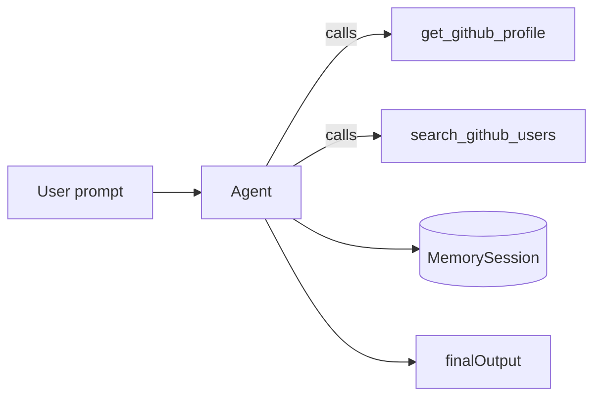
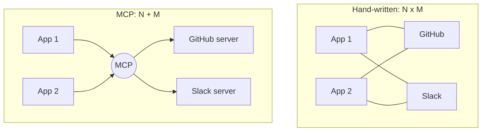
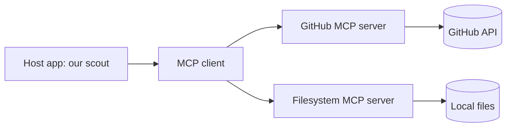
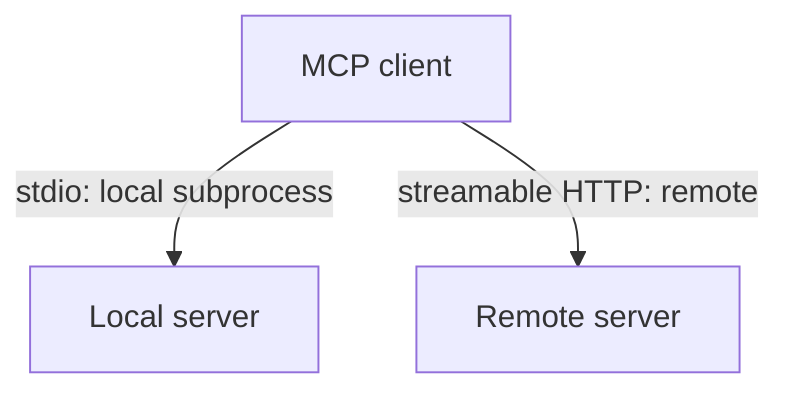
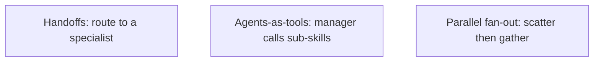
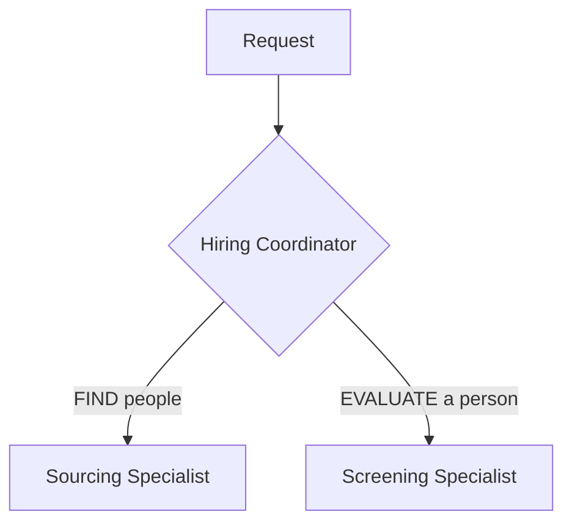
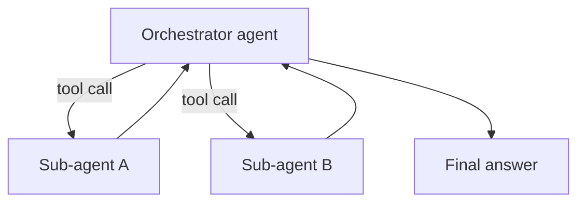
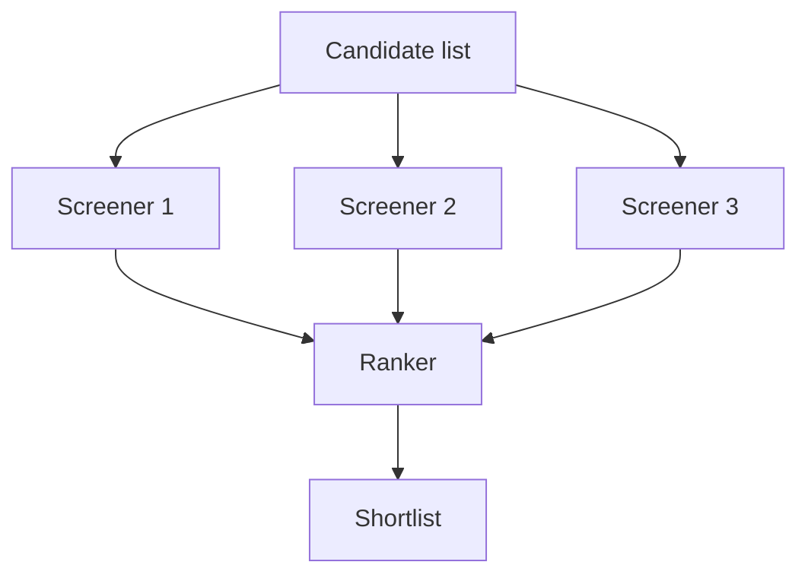
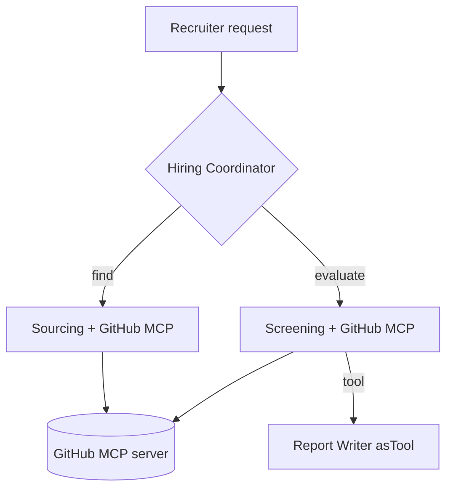

# Where we are

This morning you shipped a real agent.

<!-- pause -->



- An `Agent` with `instructions` and a `model`
- Hand-written `tool({ ... })` functions
- `MemorySession` for multi-turn memory

<!-- speaker_note: '1 min. Anchor them in the morning. Every tool was something WE wrote by hand. That is the pain we fix this afternoon.' -->

<!-- end_slide -->

# The afternoon in one line

We stop hand-writing every integration, and we stop cramming
everything into one agent.

<!-- new_line -->

- **MCP** = plug in tools other people already built
- **Orchestration** = many small agents, each good at one job

<!-- speaker_note: '1 min. State the destination. Two ideas only: MCP and multi-agent.' -->

<!-- end_slide -->

# The problem MCP solves

Every tool we wrote is hand-rolled and locked to ONE app.

<!-- pause -->

- No reuse: the next project re-writes the same GitHub calls
- No sharing: your tool can't be dropped into someone else's agent
- It does not scale: **N apps x M tools = N*M integrations**

<!-- speaker_note: '2 min. This is the classic N-times-M integration explosion. Make them feel the pain before the solution.' -->

<!-- end_slide -->

# N x M vs N + M



<!-- speaker_note: '1 min. Write the tool ONCE as an MCP server, reuse everywhere.' -->

<!-- end_slide -->

# What is MCP

**Model Context Protocol** - an open standard for connecting
agents to tools and data.

<!-- new_line -->

- A **client/server** protocol (like USB-C for agents)
- A server exposes three things: **tools**, **resources**, **prompts**
- Any MCP-aware agent can talk to any MCP server
- Write the integration once; every agent gets it

<!-- speaker_note: '2 min. Jargon: "protocol" = an agreed shape for messages. Resources = data the agent can read. Prompts = reusable prompt templates. Today we mostly use tools.' -->

<!-- end_slide -->

# MCP architecture



- **Host**: your program (the Candidate Scout)
- **Client**: the SDK code that speaks MCP
- **Server**: wraps a real system and exposes its tools

<!-- speaker_note: '1 min. The Agents SDK is the client. We just point it at a server.' -->

<!-- end_slide -->

# Transports: how client talks to server



- **stdio** - spawn the server as a child process; great for local
  dev and CLI tools (this is what we use today)
- **streamable HTTP** - call a server running elsewhere; great for
  shared, hosted, multi-user servers

<!-- speaker_note: '2 min. Rule of thumb: local tool on your machine = stdio. Hosted service = HTTP. SDK classes: MCPServerStdio vs MCPServerStreamableHttp.' -->

<!-- end_slide -->

# MCP in the Agents SDK

```ts
import { Agent, MCPServerStdio, run } from '@openai/agents';
import { model } from './setup.ts';

const token = process.env.GITHUB_TOKEN!;
const github = new MCPServerStdio({
  name: 'github',
  command: process.env.GITHUB_MCP_CMD ?? 'npx',
  args: process.env.GITHUB_MCP_ARGS?.split(' ') ?? [
    '-y',
    '@modelcontextprotocol/server-github',
  ],
  env: { GITHUB_PERSONAL_ACCESS_TOKEN: token },
  cacheToolsList: true,
});
```

- The server wants `GITHUB_PERSONAL_ACCESS_TOKEN`; we feed it our `GITHUB_TOKEN`

<!-- speaker_note: '2 min. examples/04-mcp-github.ts. These next three slides are ONE arc (config, lifecycle, tools); defer deep token/stdio questions to the lab to protect the clock. KEY: the server reads env var GITHUB_PERSONAL_ACCESS_TOKEN; we feed it our GITHUB_TOKEN. cacheToolsList avoids re-listing on every run. ~14:18 here.' -->

<!-- end_slide -->

# Connect, attach, close

```ts
await github.connect();
try {
  const scout = new Agent({
    name: 'Scout',
    instructions: 'You are a technical sourcer. Use the ' +
      'GitHub tools to research candidates.',
    model,
    mcpServers: [github],
  });
  const result = await run(scout, prompt);
  console.log(result.finalOutput);
} finally {
  await github.close();
}
```

<!-- speaker_note: '2 min. Lifecycle: connect, attach via mcpServers, ALWAYS close in finally. The agent now has every GitHub tool without us writing one line of fetch.' -->

<!-- end_slide -->

# The GitHub MCP server: free tools

`await github.listTools()` shows what the server exposes.

<!-- new_line -->

- Search repositories and users
- Read file contents, issues, and pull requests
- All without writing a single `fetch`

<!-- pause -->

```ts
const tools = await github.listTools();
console.log(`> github MCP exposed ${tools.length} tools`);
```

<!-- speaker_note: '2 min. This is the scouting payoff: search users by stack, read their repos and issues to judge real engineering signal. listTools is great for discovery and debugging.' -->

<!-- end_slide -->

# Why multi-agent?

One giant agent with 20 tools struggles.

<!-- new_line -->

- **Context bloat** - too many tools and instructions in one prompt
- **Blurred focus** - it tries to do everything, does each worse
- **Lower reliability** - more ways to pick the wrong tool

<!-- pause -->

Fix: **separation of concerns**. Small, specialized agents.

<!-- speaker_note: '2 min. ~14:35 here: done with MCP, starting multi-agent. Same instinct as small functions vs one 2000-line main(). Specialists are easier to instruct, test, and trust.' -->

<!-- end_slide -->

# Three orchestration patterns



- **Handoffs** - hand the whole conversation to a specialist
- **Agents-as-tools** - keep control, call a sub-agent like a function
- **Parallel fan-out** - run many at once, then synthesize

<!-- speaker_note: '1 min. Preview all three. We will see code for each.' -->

<!-- end_slide -->

# Pattern 1: Handoffs / triage



A **coordinator** routes the request and never answers itself.
The chosen specialist takes over the conversation.

<!-- speaker_note: '1 min. Handoff = transfer ownership. After the handoff, the specialist owns the reply.' -->

<!-- end_slide -->

# Handoff code

```ts
const sourcing = new Agent({
  name: 'Sourcing Specialist',
  handoffDescription:
    'Finds NEW candidates from criteria like role, stack, location.',
  instructions: 'You propose 3 candidate archetypes...',
  model,
});

const coordinator = new Agent({
  name: 'Hiring Coordinator',
  instructions: 'You route requests and never answer directly...',
  model,
  handoffs: [sourcing, screening],
});
```

<!-- speaker_note: '2 min. examples/05. handoffDescription tells the coordinator WHEN to pick each one. handoffs is just an array of agents.' -->

<!-- end_slide -->

# Who answered?

```ts
const result = await run(coordinator, prompt);

console.log(`handled by: ${result.lastAgent?.name}\n`);
console.log(result.finalOutput);
```

- `result.lastAgent` = the agent that produced the final answer
- Routing happened automatically based on `handoffDescription`

<!-- speaker_note: '1 min. lastAgent is how you confirm routing worked. Great for logging and debugging.' -->

<!-- end_slide -->

# Pattern 2: Manager / agents-as-tools



The orchestrator stays in charge and calls sub-agents like
tools. Use this when you want a **controlled sub-skill**, not a
full handoff.

<!-- speaker_note: '2 min. Difference from handoffs: control RETURNS to the manager. The sub-agent answers a sub-question; the manager composes the result.' -->

<!-- end_slide -->

# asTool code

```ts
const reportWriter = new Agent({
  name: 'Report Writer',
  instructions: 'Turn notes into a 4-line outreach brief.',
  model,
});
// wrap the whole agent as ONE callable tool:
const briefTool = reportWriter.asTool({
  toolName: 'write_outreach_brief',
  toolDescription: 'Turn notes into a 4-line brief.',
});
// hand briefTool to Screening like any other tool:
const screening = new Agent({ name: 'Screening Specialist',
  model, mcpServers: [github], tools: [briefTool] });
```

<!-- speaker_note: '2 min. examples/06. asTool wraps a whole agent as one callable tool. Screening keeps control and calls write_outreach_brief when ready.' -->

<!-- end_slide -->

# Pattern 3 (bonus): Parallel fan-out



No special API - just `Promise.all` over `run`, then rank.

<!-- speaker_note: '1 min. Scatter-gather. Independent items run at the same time, then one synthesizer agent combines them.' -->

<!-- end_slide -->

# Fan-out code

```ts
const verdicts = await Promise.all(
  candidates.map(async (login) => {
    const r = await run(
      screener,
      `Evaluate the GitHub user "${login}".`,
    );
    return r.finalOutput ?? `${login}: (no verdict)`;
  }),
);

const ranked = await run(
  ranker,
  `Rank these candidates:\n${verdicts.join('\n')}`,
);
```

<!-- speaker_note: '2 min. examples/07. Plain JS concurrency. Scatter with Promise.all, gather the verdicts, hand them to the ranker.' -->

<!-- end_slide -->

# Choosing a pattern

| Need | Pattern |
| --- | --- |
| Route to the right specialist | Handoffs |
| A controlled, reusable sub-skill | Agents-as-tools |
| Process many independent items at once | Parallel fan-out |

<!-- new_line -->

You can **combine** them - the capstone uses all three.

<!-- speaker_note: '2 min. This table is the slide to photograph. Routing -> handoffs. Sub-skill -> asTool. Many at once -> parallel.' -->

<!-- end_slide -->

# The capstone: Candidate Scout



GitHub MCP + handoffs + an agent-as-tool report writer =
`examples/06`.

<!-- speaker_note: '1 min. This is exactly what they build in Lab 2. Point at each piece and name the pattern.' -->

<!-- end_slide -->

# Production notes + resources

Before you ship an agent:

- **Tracing** - we disable it for the workshop; turn it ON in prod
- **Cost** - tokens add up; cache tool lists, keep prompts tight
- **Evals** - test agents on real cases, not vibes
- **Guardrails** - validate inputs and tool outputs

<!-- new_line -->

- Agents SDK: `openai.github.io/openai-agents-js`
- MCP: `modelcontextprotocol.io`
- OpenRouter: `openrouter.ai/docs`

<!-- speaker_note: '2 min. ~14:52 here. Notes sum to ~36 min, so reserve the remaining ~8 min for a single live run (ex:04 or ex:05) plus Q&A; do the live demo ONCE rather than narrating all three code slides. Set expectations for Lab 2: you now have every concept needed for the capstone. Break, then build.' -->

<!-- end_slide -->

# Lab 2: build the scout

Next: 15:00-17:00.

- Wire the GitHub MCP server (`examples/04`) - ~40 min incl. PAT setup
- Add handoffs (`examples/05`) - ~30 min
- Add the asTool report writer (`examples/06`) - ~30 min
- **Stretch** - parallel screening (`examples/07`) - only if time

<!-- new_line -->

Run anything with: `npm run ex:04` ... `ex:07`

<!-- speaker_note: '1 min. Send them to the lab handout. Encourage experimentation; the examples are a starting point, not a ceiling.' -->
